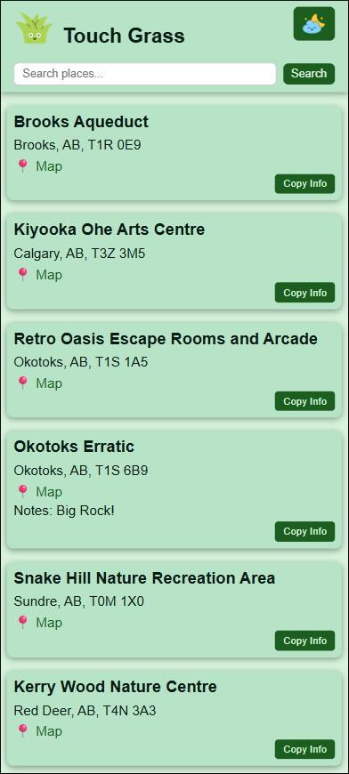
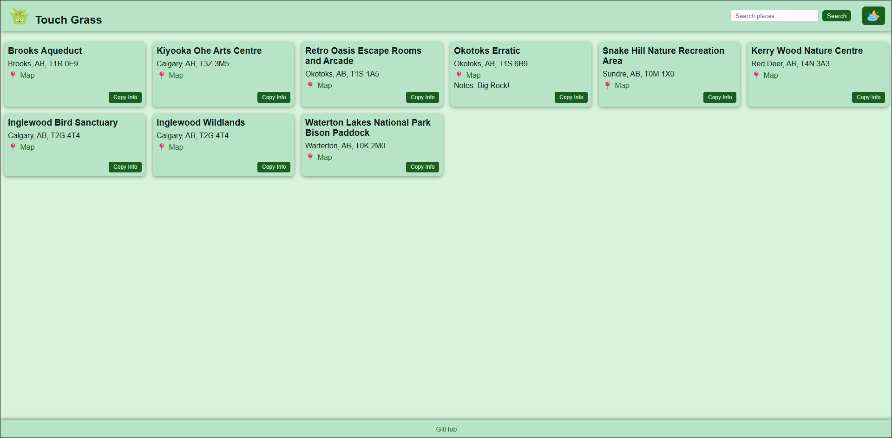
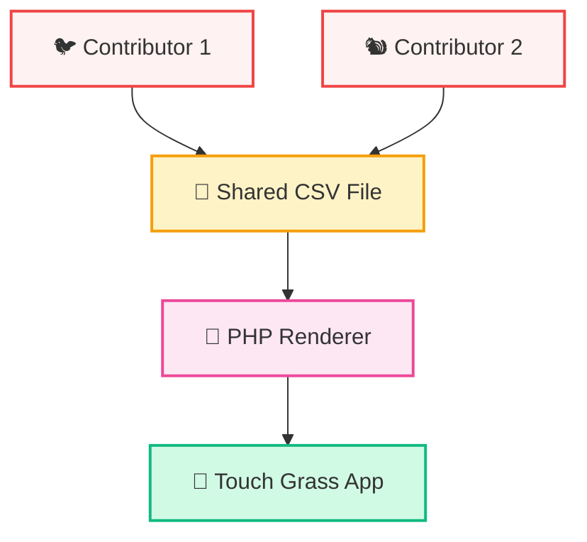

# Touch Grass 🌱
✨ [LIVE DEMO](https://touchgrass.kazvee.com/) ✨

## Description & Use Case 🤔
Touch Grass is a mobile-first interactive card gallery to document visited places for easy recommendation to friends and family, built on a shared spreadsheet and exposed as a lightweight PHP site.

## Screenshots 🖼️

### Mobile View 📱

### Desktop View 🖥️

## Features ✨
- **CSV-driven content** for easy updates
- **PHP card template** for rendering place details
- **Mobile-first responsive cards** using custom CSS grid
- **Live search filtering** to quickly find places
- **Copy Info button** to quickly copy place details to clipboard
- **Lightweight PHP site** with no database
- **Theme toggle** with light and dark modes

## Data Flow 🔁
- **Shared Spreadsheet:** Maintained as the single source of truth for all entries  
- **CSV Export:** Exported and added to the project  
- **PHP Rendering:** Reads the CSV and generates cards at runtime  
- **Client-side Interactions:** jQuery handles search, theme toggle, and copy actions

### Workflow Diagram 📑

## Built With 👩‍💻
- PHP
- CSV data
- jQuery
- Custom CSS

## Thanks & Acknowledgements 🤗
- [Grass](https://icons8.com/icon/pVT61MJVymTO/grass), [Summer](https://icons8.com/icon/hPgLrdD9eLiu/summer), and [Night](https://icons8.com/icon/FuP3MdZs4JF5/night) icons by [Icons8](https://icons8.com)
- Colour theme inspiration from [Coolors](https://coolors.co/d8f3dc-b7e4c7-95d5b2-74c69d-52b788-40916c-2d6a4f-1b4332-081c15)

## Installation 💻
- Clone this repo to your local machine
- Create file `places.csv` inside the `data` folder, using `example.places.csv` as a reference
- Run the local PHP server: `php -S localhost:8000`
- The app will be served at: [http://localhost:8000](http://localhost:8000)
